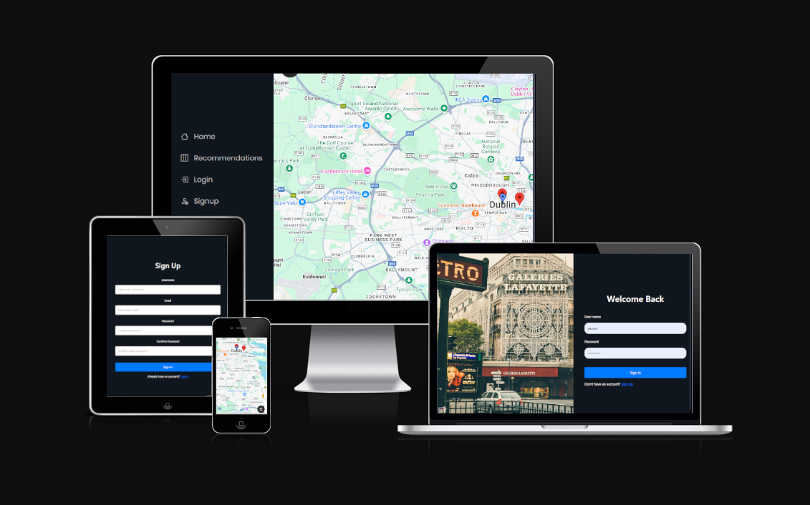

# Travel Buddy

Portfolio 4 project as part of the Diploma in Full Stack Software Development by Code Institute.
___

Travel buddy is a minimalist travelling app where you can find recommendations for other users quickly and efficiently, this also allows users to create their own profiles to share about themselves, add their own recommendations and also view others recommendations.

Visit the delployed site! - [Travelbuddy!](https://travel-buddy-pp4-f336df297d97.herokuapp.com)

## CONTENTS

- [Travelbuddy](#travel-buddy)
  - [CONTENTS](#contents)
  - [Site Objectives](#site-objectives)
- [User Experience/UX](#user-experienceux)
  - [Target Audience](#target-audience)
  - [User Stories](#user-stories)
    - [New Visitor Goals](#new-visitor-goals)
    - [Existing Visitor Goals](#existing-visitor-goals)
- [Design Choices](#design-choices)
  - [Colour Scheme](#colour-scheme)
  - [Typography](#typography)
  - [Logo and Favicon](#logo-and-favicon)
  - [Wireframes](#wireframes)
  - [Flow Diagram](#flow-diagram)
  - [Database Plan](#database-plan)
- [Features](#features)
  - [Registration](#registration)
  - [Future Features](#future-features)
  - [Features Not Included](#features-not-included)
- [Technologies Used](#technologies-used)
- [Programming Languages, Frameworks and Libraries Used](#programming-languages-frameworks-and-libraries-used)
- [Agile](#agile)
- [Deployment](#deployment)
    - [Github Deployment](#github-deployment)
    - [Creating a Fork or Copying](#creating-a-fork-or-copying)
    - [Clone](#clone)
    - [Repository deployment via Heroku](#repository-deployment-via-heroku)
    - [Deployment of the app](#deployment-of-the-app)
- [Credits](#credits)
- [Media](#media)
- [Acknowledgments and Thanks](#acknowledgments-and-thanks)

___

## Site Objectives

This site was designed with multiple major objectives in mind, mainly gaining more development experience and learning more about django

The main objectives were:

- ### Create a readable, clean and responsive and minimalistic front end

I wanted to make the site visually appealling site that allowed the user to quickly navigate with simplicity and ease as well as keeping it as uncluttered as possible

- ### Take full advantage of backend functionality

Django is a fantastic tool, and the capabilities it brings to a fullstack app like this are unrivaled, so i knew i needed it in this project

- ### Store data on an external cloud database

WE used cloudinary for avatar hosting, a code institute db for the models and heroku for the app hosting

___

# User Experience/UX

## Target Audience

- This is a simple app for users in ireland who want to travel and explore! OR just head to the nearest fun place!

## User Stories

### New Visitor Goals

- To understand what the site and content is about.
- How to navigate the site.
- Use the site to find new recommendations and (optionally) create their own account to help populate recommendations

### Existing Visitor Goals

- Log in and out of their account.
- Have full crud functionality of their account and recommendations
- Be able to contribute to finding cool places in ireland

___

# Design Choices

## Colour Scheme

I opted for a sleek and minimalist colorset with a dark palette of grays and blues to create a sleek and modern looking site

## Typography

The main fonts were used to make the text pop just enough while also not being too distracting

## Logo and Favicon

The logo was created using an online logo creator - [Brandcrowd](https://www.brandcrowd.com/)
Additonally I used a lot of icons in the page design, these were all added using bootstrap svg's / vendor files

## Wireframes

## Flow Diagram

I opted to create a flow diagram alongside erds so that potential users and other devs can get a better idea of how the site flows

(As some features were not implemented in the current version but are to add the diagram may not be wholly accurate)

# Features

The user Login or signup from the homepage

## Future Features

- User commenting system on recommednations
- More detailed recommendations
- Voting on recommendations
- Selection of country

I also want to work on code optimization and better stylistic choices, this is an app i loved making and want to work more on

## Features Not Included

- I wanted to try and get advanced filtering as well as filter resetting but couldn't in this iteration
- Eventually id also like to add more varied category filters as well as more details to a user account
- Orginally i wanted to approve recommendations via the admin panel but with testing found too many errors arising so decided to shelve
it until a later date when i could find the problem with the code

___

# Technologies Used

Here are the technologies used to build this project:

- [Vs code](https://codeanywhere.com/) To build and create this project
- [Github](https://github.com) To host and store the data for the site.
- [PEP8 Validator](https://pep8ci.herokuapp.com/) Used to check python code for errors
- [HTML & CSS Validator](https://jigsaw.w3.org/css-validator/) for html and css validation
- [ElephandSQL](https://www.elephantsql.com/) Used to store PostgreSQL database.
- [Cloudinary](https://cloudinary.com/) Used as cloud storage for images uploaded as part of the blog posts
- [Heroku](https://id.heroku.com/) Used to deploy the project

# Programming Languages, Frameworks and Libraries Used

- [HTML](https://developer.mozilla.org/en-US/docs/Web/HTML)
- [CSS](https://developer.mozilla.org/en-US/docs/Learn/Getting_started_with_the_web/CSS_basics)
- [Python](https://en.wikipedia.org/wiki/Python_(programming_language))
- [Django](https://www.djangoproject.com/)
- [Bootstrap](https://getbootstrap.com/)
- [Javascript](https://www.javascript.com)
- [Jquery](https://jquery.com)

# Agile

This project was created in tandem with a github project kanban with issue tracking, agile methodologies, story points ect
I wanted to elaborate on this more but sadly didn't have time.

- [Project Board](https://github.com/users/ShaAnder/projects/7)

___

## Deployment

### Github Deployment

The website was stored using GitHub for storage of data and version control. To do this I did the following;

After each addition, change or removal of code, in the vscode terminal (or whatever your ide is) type:

- git add .
- git commit -m "meaningful commit message"
- git push

The files are now available to view within your github repository.

### Creating a Fork or Copying

To clone/fork/copy the repository you click on the fork tab which is situated next to unwatch tab in the top right corner of the page

### Clone

To create a clone you do the following;

1. Click on the code tab, left of the Gitpod tab
2. To the right of the repository name, click the clipboard icon
3. In the IED open GitBash
4. Change the working directory to the location you prefer
5. Add Git Clone with the copy of the repository name
6. Clone has been created

### Repository deployment via Heroku

- On the [Heroku Dashboard](https://dashboard.heroku.com) page, click New and then select Create New App from the drop-down menu.
- When the next page loads insert the App name and Choose a region. Then click 'Create app'
- In the settings tab click on Reveal Config Vars and add the following vars (you may need to get some api keys)

1. Cloudinary URL
2. Postgres Database URL
3. GOOGLE MAPS API Key
4. HOST EMAIL
5. HOST PW
6. Port (8000) 
7. IP
8. SECRET KEY

### Deployment of the app

- Click on the Deploy tab and select Github-Connect to Github.
- Enter the repository name and click Search.
- Choose the repository that holds the correct files and click Connect.
- A choice is offered between manual or automatic deployment whereby the app is updated when changes are pushed to GitHub.
- Once the deployment method has been chosen the app will be built and can be launched by clicking the Open app button which should appear below the build information window, alternatively, there is another button located in the top right of the page.

___

## Credits

This project was actually based on a conversation I had with a friend about never being able to find good places to go locally or even what was around, so i figured why not build an app to do it!

I watch a lot of code related content and i used a lot of tutorials on how to build django apps from them. videos from people like [Mosh](https://www.youtube.com/watch?v=rHux0gMZ3Eg) really helped me progress my knowledge, sadly i still have a long way to go, especially when it comes to working with js and django, but this has been an amazing opportunity for learning and growth! 

The Readme layout was based on the example by [Kera Cudmore - Readme Examples](https://github.com/kera-cudmore/readme-examples/blob/main/README.md?plain=1) 

The wireframe mockups were created using [Figma](https://https://www.figma.com/)

Once complete, the readme file was passed through a spelling and grammar check via [Grammarly](https://www.grammarly.com/)

___

## Media

For placeholder images such as the avatar i used a default avatar i made and other images came from  [pexels](https://www.pexels.com/search/travel/) which provides a library of stock images that display as a placeholder. Many thanks to those artists

All other content and images are my own.

___

## Acknowledgments and Thanks

Youtube especially mosh for his helpful videos

Chat gpt for being able to help me understand some of the most annoyingly written docs in a long time

And my friends maki and alex, who honestly if i wasn't able to sit and chat to them while working id probably have gone insane by now :smile:

For help with manual testing:

- Various friends and family, and whatever random stranger didn't tell me to go away immediately
