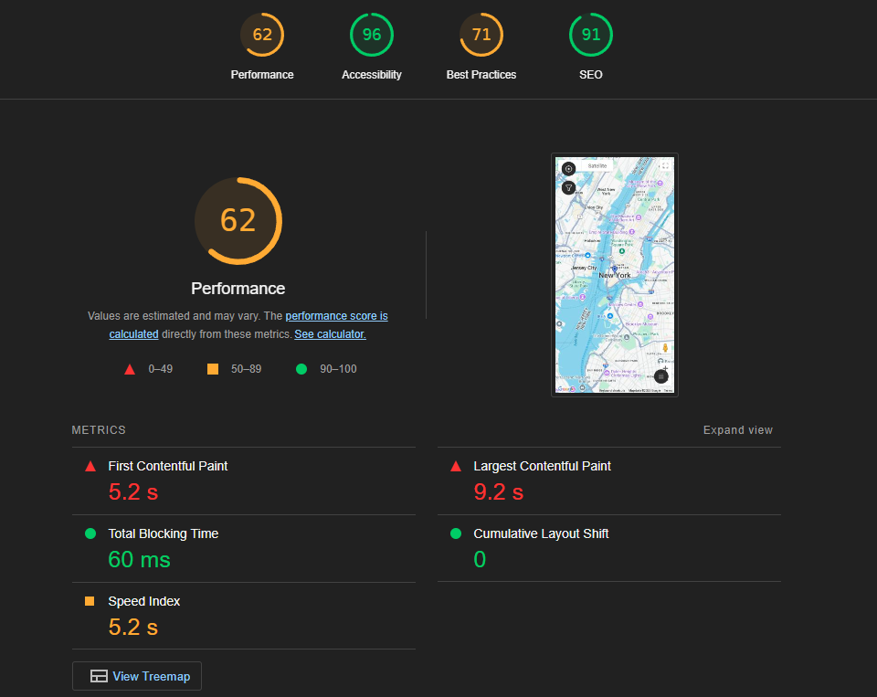
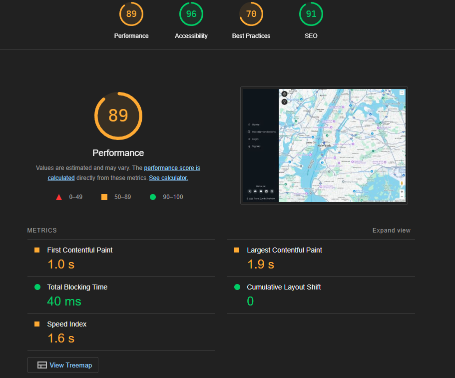

# Testing

The deployed project live link is [Travel Buddy](https://travel-buddy-pp4-f336df297d97.herokuapp.com)
This application was extensively tested via automatic and manual tests these are detailed below 


## Brief Intro
The testing of this application came in three parts, as the testing was extensive and covered varying different
aspects of the code base i decided to opt for a non standard structure and created a testing folder. 

Inside this folder you will find the test files, the testing.md as well as the validation images which
can be seen later in this document.

## Manual Testing
Manual testing was undertaken in a variety of ways, these included firstly building tests to test each part of the code base. These are detailed more in the test.py files, as well as this we tested the responsive design on browsers for clipping or design errors and finally ran through a batter of manual tests and expected behaviour tests. These are detailed below

As each section or Function/Model was built during this project, I was testing for functionality and styling issues that may have arisen (see table below), which were corrected or fixed before continuing. I also had friends test the site by signing up, adding and recommendations using various devices on varying platforms (IOS, Android, Mobile, Tablet etc) and reporting back any issues they encountered with functionality or styling. Anyone who wishes to try out nad test the site and give feedback is welcome to do so!

### Manually built tests
Throughout development i continously built manual test case code to check functions, models views ect worked correctly, while I won't include them in this project, they helped me with a lot of debugging issues especially with account creation and stopping foreign crud operations

As well as this I also used a lot of inline debugging from print statements to try/except block and line by line testing.

### Browser Tests
The game was tested on a variety of browsers:

- Chrome
- Edge
- Firefox
- Opera
- Safari

Result:

*For any Fails, there is a more detailed description below the table*

#### ADMIN

| TEST | OUTCOME | PASS/FAIL|
|:---:|:---:|:---:|
| Create Recommendation | Recommendation successfully displayed | Pass |
| Recommendation Displays on map | Recommendations displayed on map with no issue | Pass |
| Filter Recommendations | On some devices / platforms recommendations failed to filter correctly (*) | Fail |
| Delete recommendations | Recommendation deleted successfully | Pass |
| Edit Recommendaitons | Recommendation edited successfully | Pass |
| Users Must verify emails | Users cannot engage with signin unless verifying | Pass |
| User editing data | Defensive programming in place to stop a user performing crud on other users data | Pass |

(*) - This bug arises due to the category filter not receiving the api call correctly, while i have not figured out how to replicate it yet i know it's an issue with OLDER versions of the django rest framework. It works most times but sometimes because a category fails to populate / be captured on recommendation creation we get this bug.

#### User

| TEST | OUTCOME | PASS/FAIL|
|:---:|:---:|:---:|
| Create Account | Created successfully | Pass |
| User can view pages without signup | Viewed pages without being authenticated | Pass |
| Login | Login Successful | Pass |
| Logout | Logout Successful | Pass |
| View recommendations | Recommendation page loads successfully | Pass |
| Add Recommendations | Can add recommendations and view them on map (edit and delete on profile) | Pass |
| View edit and delete profile | User can view, edit and close their accounts | Pass |
| Filter Recommendations by category | Sometimes filtering fails to trigger due to rest framework (*) | Open |
| Defensive programming, user cannot access protected pages| 4-4 page triggers preventing user from accessing | Pass |

(*) Biggest app issue atm, django rest framework is not working as intended, this is largely in part due to my limited knowledge with serializers.

## Automatic Testing
As the name implies this is testing that was done automatically via the inbuilt django tests or 
the code validation websites. I'll break the two of these up into subcategories.

### Lighthouse

Sadly best practices and performance is low with this project, this is due to how i had to break a lot of rules to get the app to run, 
for example HTML validators will ALL throw a fit if you include {{}} in your tages, for performance i think this is due to the main component being a live constantly updated map

Mobile



Desktop



## Validation Testing

As for validation files, I thoroughly tested every pages validation, and to save some of the hassle of multiple screenshots i'll summarize it instead.

#### HTML & CSS

For HTML and CSS:

- Html errors only included the validator complaining about having no <head> tags or the use of {{}} in the page, this is due to django and how it generates templates, any preventable erros were fixed in testing
- As for CSS there was one error in 1200 lines of code, this was a to gradient i tried using on a background color tag, it actually worked but the validator was not happy.

#### Python Testing

Python pep8 validation was done via [Code Institute's Python Linter](https://pep8ci.herokuapp.com/)

The only errors recieved here were where some lines of text exceeded the limit of 79 characters.

Python Files Tested:

- models
- forms
- views
- urls

#### Javascrip Testing

For javascript i ended up using a few different script checkers, aside from some missing ";" tags the only problems were that i was using ES6 specific synatax / arrow functions ect, which obviously older browsers do not support. 


## EXTRA TESTS


#### Testing logged out view

One of the biggest issues i ran into was the fact that in dev mode i was always treat as loggin in or authenticated, the only way to fix this was to 
clear my session cache, to simulate a logged out state i utilized a global variable that we could manually apply to force a logged out state:

In travel_buddy.settings

```py
ANON_MODE = True
```

Then whenever i needed to see if a feature appeared or disappeared with a toggle i could add it to the is_authenticated conditionals, this 
helped immensely especially in the early versions as I had not gotten login and signup ready

```py

```

As we managed to get login systems online I moved to a more django form of testing and cleared my sessions followed by setting up test users, this
was achieved with the following steps:

```py
1/  python manage.py shell

2/  from django.contrib.sessions.models import Session
    Session.objects.all().delete()

3/  python manage.py createsuperuser
    python manage.py shell

4/  from django.contrib.auth.models import User
    User.objects.create_user(username='testuser', email='test@example.com', password='password123')
```

#### Testing Email Sending

I wanted to get the login / logout signup up and running early so that we could create proper views based on user login status, however i did not
want to flood user emails, so to simulate and test email sending with core components i found that adding console rather than smtp (django docs)
i was able to send email information to the console instead so i could get realtime feedback without having to send emails 

```py
EMAIL_BACKEND = 'django.core.mail.backends.console.EmailBackend'
```


Utilizing the django shell and the test backkend var we tested to see if errors would be raised when emailing the recipient, this 
raised 1 error where we were not using a secure enough account, after enabling two factor and an app password this was no longer 
raised.

Following this i tested sending multiple emails to various accounts to full successes all around

## Known Bugs
At different points throughout this project, I encountered various bugs involving the styling. These usually appeared after adding a new section or template page. These were all fixed using Bootstrap classes or custom CSS to override any issues caused by Bootstrap itself.

Towards the end of completion, I had issues with heroku not taking the google app api, I had to change my script load order to get this fixed

The current two biggest issues are the aforementioned filtering bug nad sometimes the cities will not show due to googles pagination, which we need to work on in the future

There's also a few profile styling bugs as well as some function call bugs, as it's one script file it loads the entire thing every page refresh, I actually may look to compartmentalizing each script to it's relevant template wiht script tags to see if it not only fixes the bug of incorrectly firing functions or the performance.

These functions firing do not cause any problems, it's just they show up on the console.

### [BACK TO README](https://github.com/shaAnder/travel_buddy/blob/main/README.md)
