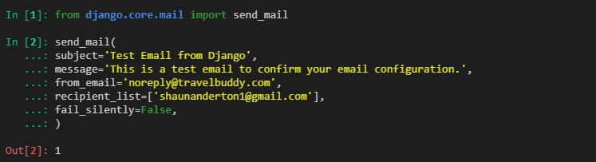

# Testing

The deployed project live link is [Travel Buddy]()
This application was extensively tested via automatic and manual tests these are detailed below 


## Brief Intro
The testing of this application came in three parts, as the testing was extensive and covered varying different
aspects of the code base i decided to opt for a non standard structure and created a testing folder. 

Inside this folder you will find the test files, the testing.md as well as the validation images which
can be seen later in this document.


## Automatic Testing
As the name implies this is testing that was done automatically via the inbuilt django tests or 
the code validation websites. I'll break the two of these up into subcategories.

### Automatic tests


### Validation

#### PEP8 Python Validation

<details>
<summary><strong style="color:yellow"></strong></summary>

</details>

<details>
<summary><strong style="color:yellow"></strong></summary>

</details>

<details>
<summary><strong style="color:yellow"></strong></summary>

</details>

<details>
<summary><strong style="color:yellow"></strong></summary>

</details>

#### JS validation


#### HTML CSS Validation


<details>
<summary><strong style="color:green"></strong></summary>

</details>

<details>
<summary><strong style="color:green"></strong></summary>

</details>

<details>
<summary><strong style="color:green"></strong></summary>

</details>

<details>
<summary><strong style="color:green"></strong></summary>

</details>

## Manual Testing
Manual testing was undertaken in a variety of ways, these included firstly building tests
to test each part of the code base. These are detailed more in the test.py files, as well as
this we tested the responsive design on browsers for clipping or design errors and finally
ran through a batter of manual tests and expected behaviour tests. These are detailed below

### Manually built tests
The manually built tests were designed to do the following:

### Browser Tests
The game was tested on a variety of browsers:

- Chrome
- Edge
- Firefox
- Opera
- Safari

Result:


### Expected Behaviours

| **Feature**              | **Action**                                                                | **Expected Result**                         | **Actual Result** |
| ------------------------ | ------------------------------------------------------------------------- | ------------------------------------------- | ----------------- |
|


### EXTRA TESTS


#### Testing logged out view

One of the biggest issues i ran into was the fact that in dev mode i was always treat as loggin in or authenticated, the only way to fix this was to 
clear my session cache, to simulate a logged out state i utilized a global variable that we could manually apply to force a logged out state:

In travel_buddy.settings

```py
ANON_MODE = True
```

Then whenever i needed to see if a feature appeared or disappeared with a toggle i could add it to the is_authenticated conditionals, this 
helped immensely especially in the early versions as I had not gotten login and signup ready

```py

```

As we managed to get login systems online I moved to a more django form of testing and cleared my sessions followed by setting up test users, this
was achieved with the following steps:

```py
1/  python manage.py shell

2/  from django.contrib.sessions.models import Session
    Session.objects.all().delete()

3/  python manage.py createsuperuser
    python manage.py shell

4/  from django.contrib.auth.models import User
    User.objects.create_user(username='testuser', email='test@example.com', password='password123')
```

#### Testing Email Sending

I wanted to get the login / logout signup up and running early so that we could create proper views based on user login status, however i did not
want to flood user emails, so to simulate and test email sending with core components i found that adding console rather than smtp (django docs)
i was able to send email information to the console instead so i could get realtime feedback without having to send emails 

```py
EMAIL_BACKEND = 'django.core.mail.backends.console.EmailBackend'
```



Utilizing the django shell and the test backkend var we tested to see if errors would be raised when emailing the recipient, this 
raised 1 error where we were not using a secure enough account, after enabling two factor and an app password this was no longer 
raised.

Following this i tested sending multiple emails to various accounts to full successes all around

## BUG Fixing
As this was built as a small scale project and django is still relativly fresh to me there was
sadly bound to be present, all known bugs are listed below, for fixing purposes at a later date

### Known Bugs

Current bugs = Can't get a locations geolocation

<br>


### [BACK TO README](https://github.com/shaAnder/travel_buddy/blob/main/README.md)
